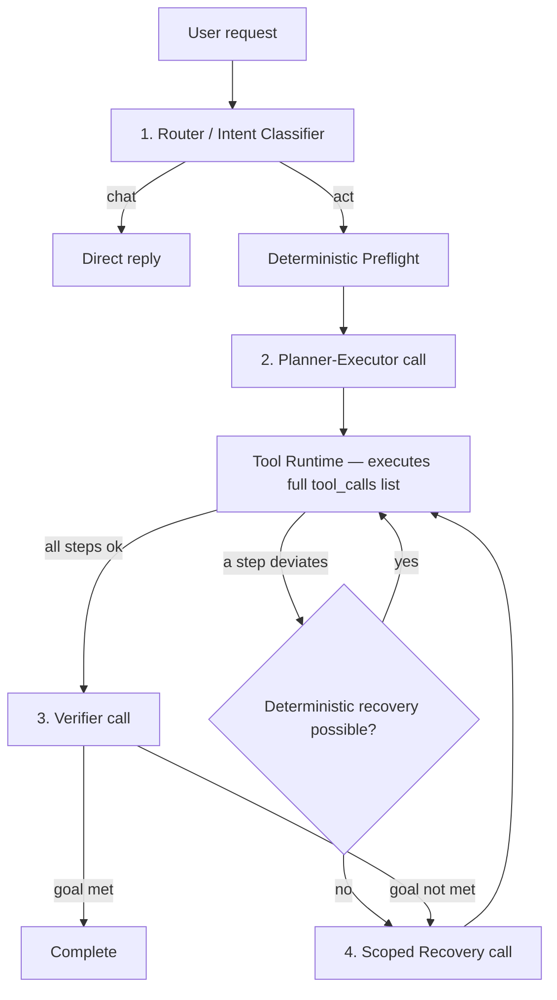
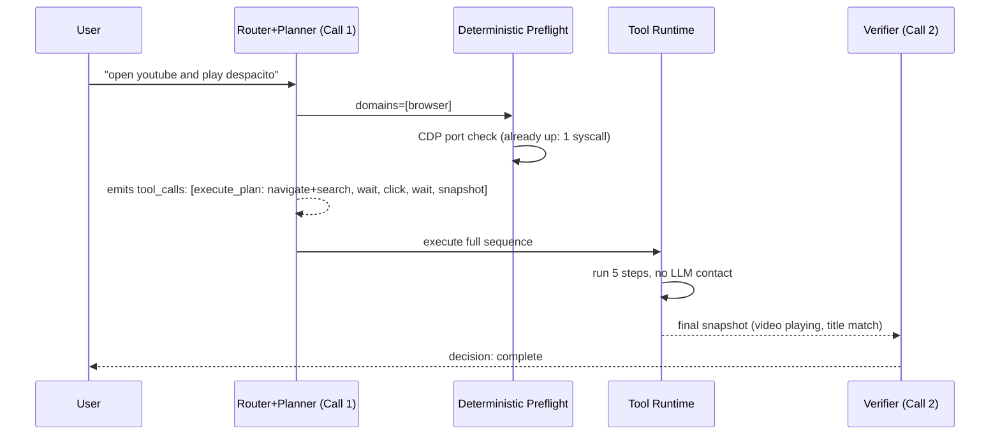

# Lucy Harness Architecture v2
## A Minimal-Call, Zero-Ambiguity Design for Computer-Use Agents

**Status:** Implemented — v2 harness (`crates/lucy-runtime/src/harness.rs`) is the execution path; the v1 TRIAGE → Tool Selector → Closed-Loop Controller pipeline is retained in `crates/lucy-runtime/src/planner.rs` for its validation tests only.
**Target:** Reduce a task like "open YouTube and play Despacito" from **13 LLM calls** to **2–4 LLM calls**, with correctness guarantees that prevent silent task abandonment.

---

## 1. Why the Current Design Fails

Before specifying the new design, it's worth being precise about what's broken today, because every fix below traces back to one of these four root causes.

### 1.1 No native tool calling
The current harness never populates the `tools` field on the chat-completions request. Every call instead pastes a giant text block of tool descriptions into the user message and asks the model to hand back hand-rolled JSON (`{"tool":"...","arguments":{}}`) inside `assistant.content`. This means:
- The model cannot express "call these 5 tools in sequence" in a single structured response — it can only describe one step at a time in prose-JSON.
- Every response must be parsed with bespoke, brittle string logic instead of the provider's guaranteed `tool_calls` array.
- The harness cannot use parallel tool calls, which most providers support natively.

### 1.2 One LLM call per atomic action, plus one LLM call per verification of that action
The observed trace calls a dedicated Tool Selector for every subtask, and a dedicated Closed-Loop Controller after every result — including after read-only observation subtasks the harness itself generated. This turns a single click into three LLM round-trips (select → execute → verify-decide), before any actual task progress is made.

### 1.3 Environment bootstrapping is routed through the reasoning model
Whether Brave is running with `--remote-debugging-port=9222` is deterministic, checkable in milliseconds with a shell command, and fixable with a known recipe. In the observed trace, discovering and fixing this consumed **8 of the 13 LLM calls** (ids 40–49), including one wrong guess (`google-chrome`, which doesn't exist on the box) and one race condition (checking the port before the backgrounded process had bound it). None of this required judgment — it required a state machine.

### 1.4 The plan can silently lose the original goal
Because subtasks are consumed one at a time and replans splice in *new* subtasks without guaranteeing the original goal subtask is re-queued, the run in the trace ended with `"decision":"continue"`, `"remaining_plan":[]`, having never navigated to YouTube. There is no invariant anywhere in the current design that says "the plan is not allowed to empty out until the original goal's success condition is met."

The rest of this document fixes each of these in turn.

---

## 2. Design Principles

These five principles are load-bearing. Every component spec later in this document exists to serve one of them.

1. **One call plans, many tools execute.** The LLM's job is to *decide* the sequence of tool calls; the runtime's job is to *execute* that sequence without going back to the LLM unless something deviates from the plan. Planning and execution are different concerns and must not be interleaved into "one tool call, one LLM round-trip."
2. **Determinism before reasoning.** Anything that has a fixed, checkable answer (is the browser open? is the port listening? does this file exist?) is handled by code, never by an LLM call. The LLM is only invoked for things that require judgment: intent, tool selection under ambiguity, and success/failure interpretation.
3. **Verify the outcome, not the step.** Verification happens once per plan (or once per sub-goal for genuinely multi-phase tasks), against the *user's* success condition — never after each individual tool call. A tool call returning HTTP 200 or `success:true` is not evidence of task success and is not, by itself, worth an LLM call either.
4. **The goal is a first-class object that cannot be dropped.** The original user goal and its success condition live outside the mutable subtask queue, in session state, for the entire run. No replan, recovery, or infra fix-up is allowed to complete a run without re-checking that this object's success condition is satisfied.
5. **Escalate to the LLM only on genuine deviation.** A step either succeeds as predicted, or it doesn't. If it doesn't, that's the *only* time the harness re-enters the reasoning loop mid-plan. Expected, scriptable failures (browser not running, tab not found, element not yet rendered) are handled by deterministic retry/bootstrap logic first; the LLM sees them only if deterministic recovery also fails.

---

## 3. Target Call Budget

| Scenario | LLM calls | Notes |
|---|---|---|
| Chat-only ("hello", "what's my IP") | **1** | Router recognizes chat mode and replies inline. |
| Simple act, environment already healthy (browser open, debug port live) | **2** | Call 1: Router+Planner combined. Call 2: Verifier. |
| Simple act, environment needs deterministic bootstrap (browser not running) | **2** | Bootstrap is code, not an LLM call — call budget unchanged. |
| Act with one genuine deviation (element not found, wrong page) | **3–4** | Call 3 is a targeted Recovery call scoped to only the deviation, not a full re-plan. |
| Multi-phase task (e.g., "book the cheapest flight and email me the confirmation") | **N phases + 1** | One Planner+Executor call per independent phase where later phases depend on earlier results, plus one final verifier. |

This is the number to hold the implementation accountable to. If a routine single-app task exceeds 4 calls, that's a bug, not "the model being cautious."

---

## 4. Component Architecture



### 4.1 Router / Intent Classifier (Call 1)
**Input:** user request, short conversation history, a *compact* capability summary (domain names + counts only, not full schemas — schemas are only needed once a domain is selected).

**Output (single structured object, not free text):**
```json
{
  "mode": "chat" | "act",
  "reply": "string, only if mode=chat",
  "domains": ["browser"],
  "goal_statement": "one sentence, only if mode=act",
  "success_condition": "one observable, checkable sentence"
}
```

**Rules:**
- If `mode=chat`, the harness replies immediately. This is the entire interaction — 1 call, done.
- If `mode=act`, `success_condition` is written down **once**, here, and never rewritten by any later component. It is carried in session state as the immutable acceptance test for the whole run.
- `domains` narrows which tool schemas get loaded into Call 2 — this is what keeps Call 2's prompt small instead of dumping all 68 tools every time.

This can frequently be **merged into Call 2** (see 4.2) for simple single-domain requests — see §5.

### 4.2 Deterministic Preflight (Code, 0 LLM calls)
Before any LLM sees a browser-domain task, the runtime itself checks and repairs environment invariants relevant to the selected domain(s). This is a plain state machine, not a prompt.

```
function preflight_browser():
    if cdp_port_responds(9222):
        return READY
    proc = find_running_process(["brave", "chromium", "google-chrome"])
    if proc and not proc.has_flag("--remote-debugging-port"):
        relaunch(proc.binary, extra_flags=["--remote-debugging-port=9222"])
    elif not proc:
        launch(config.default_browser_binary, flags=["--remote-debugging-port=9222"])
    poll_until(cdp_port_responds(9222), timeout=8s, interval=250ms)
    if not cdp_port_responds(9222):
        return FAILED("browser did not come up with CDP after launch")
    return READY
```

Key properties that the observed trace violated and this fixes:
- **No guessing binary names.** `config.default_browser_binary` is read from a config file populated once at install time (`which brave || which google-chrome || which chromium`), not guessed fresh by the LLM every run.
- **No race conditions.** `launch()` backgrounds the process; the harness then **polls** the port rather than checking once immediately after `&`.
- **Idempotent.** If the browser is already correctly running, this function returns in one syscall, not 8 LLM calls.
- **Domain-scoped.** A `desktop`-only task never triggers this function at all.

Every tool domain (`desktop`, `clipboard`, `files`, etc.) gets an equivalent preflight function. This is the single highest-leverage change in this document — it alone removes 8 of the 13 calls in the observed trace.

### 4.3 Planner-Executor (Call 2)
This is the component that replaces both the old Planner and the old per-step Tool Selector. It receives the goal, the success condition, current relevant observations (if cheaply available), and the **full tool schemas for only the selected domain(s)** — via the provider's native `tools` parameter, not pasted as text.

**Input:**
- `goal_statement`, `success_condition` (from Router, or inlined if merged — see §5)
- Native `tools` array (JSON Schema function defs, provider-native format)
- Any zero-cost context already known (active tab URL, focused window title) — cheap ambient state the runtime already tracks, not a fresh observation call

**Output:** the model's native `tool_calls` array — **the full ordered sequence needed to reach the goal**, not one step.

```json
[
  {"name": "browser_execute_plan", "arguments": {
     "steps": [
       {"type": "navigate", "url": "https://www.youtube.com/results?search_query=despacito"},
       {"type": "wait", "url_contains": "results"},
       {"type": "click", "selector": "ytd-video-renderer a#video-title"},
       {"type": "wait", "url_contains": "watch"},
       {"type": "snapshot"}
     ]
  }}
]
```

**Rules:**
- The system prompt **mandates** batch/macro tools (`execute_plan`, `act_batch`, etc.) whenever the target domain has one, and forbids single-action tool selection when a batch tool covers the same steps. This was explicitly stated as a preference in the old prompt and the model ignored it because nothing enforced it — enforce it by *not offering* the single-action tools in the same call when a batch tool exists for the domain, unless the batch tool's schema genuinely cannot express the step (e.g., a native desktop click needs coordinates a batch browser-plan can't hold).
- The final step of the returned sequence is always a read-only observation (`snapshot`, `extract`, or domain-equivalent) whose output becomes the input to the Verifier. This guarantees Call 3 never needs its own observation round-trip.
- The Tool Runtime (§4.4) executes the **entire returned array** without going back to the LLM, unless a step's result is an error or a defined "unexpected state" signal (§4.5).

### 4.4 Tool Runtime (Code, 0 LLM calls)
Pure execution layer. Takes the `tool_calls` array from Call 2 and runs each one against the real MCP servers in order, respecting `depends_on`/sequencing already encoded in the batch call. Collects all results into a single `execution_trace` object.

```json
{
  "steps": [
    {"tool": "browser_execute_plan", "status": "ok", "result": {"final_url": "https://www.youtube.com/watch?v=...", "snapshot": {...}}}
  ],
  "duration_ms": 4210,
  "deviated": false
}
```

If any step's `status` is `error`, or the result doesn't match an expected shape, `deviated` is set `true` and the runtime first attempts **deterministic recovery** (§4.5) before ever touching the LLM again.

### 4.5 Deterministic Recovery Table (Code, 0 LLM calls, first line of defense)
A small, explicit table of known-shape failures mapped to known-shape fixes, checked *before* escalating to a Recovery LLM call:

| Signal | Deterministic fix | Then |
|---|---|---|
| `CDP unreachable` | Re-run preflight (§4.2) | retry same step once |
| `element not found` and page still loading (`document.readyState != complete`) | wait up to 3s, poll | retry same step once |
| Tool returns `timeout` | retry once with 2x timeout | if fails again, escalate |
| Process not found for launch | consult `config.binary_fallbacks[domain]` list (not LLM guess) | retry launch |

Only if the deviation isn't in this table, or the single deterministic retry also fails, does the harness make a **Recovery call**.

### 4.6 Recovery Call (Call 3 or 4 — only on genuine deviation)
**Input:** goal, success_condition, the **specific failed step** and its error (not the entire history), current relevant tool schemas.

**Output:** a *replacement* tool_calls array for the remaining unmet part of the goal — never a full re-plan from scratch, and never a subtask that could satisfy `success_condition` being marked "handled" by something that doesn't actually address it.

**Hard invariant enforced by the runtime, not the prompt:** the recovery response is rejected and re-requested if it does not, when combined with already-succeeded prior steps, plausibly lead to `success_condition`. This is the direct fix for the trace's failure mode where a browser-launch detour silently replaced the "play the song" goal.

### 4.7 Verifier (Final call)
**Input:** `success_condition` (verbatim from Router), the final observation captured as the last step of Call 2/3/4's tool sequence (already in hand — no new tool call needed to get it).

**Output:**
```json
{"decision": "complete" | "recover", "evidence": "one sentence citing the observed state", "unmet_reason": "string, only if recover"}
```

**Hard invariant:** `"decision":"recover"` **must** include a non-null next action, or the runtime raises an error and retries the Recovery call — `continue` with an empty plan and no subtask, as seen in the original trace, is not a legal output shape at all. This state is unreachable by construction because `complete`/`recover` are the only two options — there is no third "continue and do nothing" branch to accidentally select.

---

## 5. Merging Router + Planner for Simple Tasks

For the common case — single-domain, unambiguous, no clarification needed — Router (§4.1) and Planner-Executor (§4.2) should be **one call**, not two, to hit the 2-call budget in the table in §3. The combined prompt:

1. Classifies chat vs act.
2. If act: states the goal and success condition **and** immediately returns the full native `tool_calls` sequence in the same response, using tool schemas for the domain(s) it infers from the request (the harness can pass a superset of 2-3 most-likely domains' schemas up front for common request shapes, falling back to a domain-only first call for genuinely cross-domain or unclear requests).

Only fall back to the two-call split (Router first, Planner second) when:
- The request plausibly spans more than ~2 domains (harness doesn't want to pay for 60+ tool schemas on every call), or
- The Router genuinely cannot resolve which domain applies from the request text alone.

This is why the budget table lists "2" for the common case: Router+Planner merged = 1 call, Verifier = 1 call.

---

## 6. Ambiguity Policy (Kept, Tightened)

The existing "Ambiguity Policy" language (resolve harmless ambiguity from live state, ask only when two materially different actions are plausible and wrong choice has real consequences) is sound and should be preserved — but it must be **enforced structurally**, not just stated in prose:

- **Observation is cheap, asking is expensive.** If ambiguity can be resolved by an observation the harness already has cached (active tab, focused window) or can get from the same tool_calls sequence, it must be — the model is never allowed to ask a clarifying question when a `snapshot`/`get_ui_tree` call in the same plan would resolve it.
- **Destructive-action ambiguity is the only kind that pauses for user input.** File deletion, sending messages, purchases, irreversible settings — anything matching a `destructive:true` flag in the capability index — requires explicit confirmation before the corresponding tool_call executes, regardless of how confident the plan is. This should be a runtime gate keyed off the capability metadata (`destructive` field already present in your capability index, e.g. `excalidraw_clear`, `clear_screenshots`), not something the model has to remember to apply.
- **"Open X" never means "launch a second window."** Encode this as a hard rule the Planner-Executor's system prompt states once, and as a runtime check: before emitting a `browser_open`/launch-type tool call, the runtime checks `preflight` state (§4.2) — if a usable browser context already exists, `browser_open` is *removed from the offered tool list* for that call, not just discouraged in prose. Removing the footgun from the schema is stronger than asking the model not to pick it.

---

## 7. Data Contracts

All inter-component payloads are strict JSON Schema, validated by the runtime before use (reject-and-retry once on schema violation, escalate to Recovery on second violation). No component may emit free-text commentary outside the schema — this is what "no ambiguity" means operationally: every LLM response is machine-checked before another line of the harness runs.

**Session goal object** (immutable for the run, created once by Router, read everywhere):
```json
{
  "goal_id": "uuid",
  "goal_statement": "string",
  "success_condition": "string",
  "created_at": "iso8601",
  "domains": ["browser"]
}
```

**Planner-Executor output** — native provider `tool_calls`, no custom wrapper needed; this is the entire point of using real function calling instead of JSON-in-text.

**Verifier output:**
```json
{"decision": "complete", "evidence": "string"}
```
or
```json
{"decision": "recover", "evidence": "string", "unmet_reason": "string"}
```

---

## 8. Sequence Diagram — Target State for "open youtube and play despacito"



**2 LLM calls total**, assuming the browser environment is already healthy. If it isn't, Preflight (§4.2) adds 0 LLM calls and a few hundred ms to a few seconds of deterministic work — never an LLM round-trip.

---

## 9. Failure-Mode Walkthrough — What Changes vs. the Observed Trace

| Observed trace step | New design |
|---|---|
| Call 38: planner emits 1 subtask (navigate) | Call 1: planner emits full 5-step `execute_plan` tool_call directly |
| Call 39: tool selector picks `browser_snapshot` instead of navigating | Not possible — batch tool already contains navigate; single-action `browser_navigate`/`browser_snapshot` aren't offered as ambiguous alternatives when a batch tool fully covers the step |
| Call 40: verify-1, discovers CDP down | Preflight (§4.2) catches this **before** Call 1 even returns, or the runtime's execution of the batch call surfaces the CDP error as a deviation handled by §4.5 without an LLM call |
| Calls 41–49: 9 calls of guess-launch-check-relaunch-recheck for the browser | Preflight state machine: 1 deterministic function, config-driven binary name, poll-based readiness check — 0 LLM calls |
| Call 50: `continue` with empty plan, task silently abandoned | Illegal by construction — Verifier can only return `complete` or `recover`, and `recover` requires a non-null action; goal object's `success_condition` is checked explicitly, not inferred from "nothing left in queue" |
| **Total: 13 calls, 0% task completion** | **Total: 2 calls (healthy env) or 2 calls + preflight work (unhealthy env), 100% task completion or an explicit, evidenced `recover` state** |

---

## 10. Implementation Checklist for the Coding Agent

1. **Switch every LLM call to native function/tool calling.** Stop building the "ALLOWED TOOLS AND EXACT SCHEMAS" text blob; pass real `tools` arrays and read `response.tool_calls`, not `response.content`. If `gemini-web-opencode` cannot do this, that's a blocking constraint — either get a model/endpoint that supports it, or accept this document's call-count targets are unreachable on that backend.
2. **Delete the per-step verify subtask pattern.** Verification is one call, at the end of a batch, against the immutable `success_condition` — never after each tool call.
3. **Build the Preflight module first.** One function per domain (`browser`, `desktop`, `clipboard`, ...), each: check → repair-if-needed → poll-until-ready → return READY/FAILED. This is pure code, ships without touching any prompt.
4. **Make the goal object immutable and separately tracked from the mutable subtask/tool_call queue.** The Verifier reads from the goal object, never from "is the queue empty."
5. **Enforce batch-tool preference by removing single-action tools from the offered schema**, not by asking nicely in the prompt, whenever a batch tool (`execute_plan`, `act_batch`) can express the same steps.
6. **Add the deterministic recovery table (§4.5)** as a first-class module the runtime consults before any Recovery LLM call.
7. **Validate every LLM response against its JSON Schema before use**; reject-and-retry once, then escalate. This is what removes "ambiguity" as a category of bug — malformed or off-contract output never reaches the runtime.
8. **Instrument call count per task** as a first-class metric from day one, alerting if any single-domain, single-app task exceeds the §3 budget — this is what keeps the system honest as it grows past the YouTube example.

---

## 11. System Prompts (Reference Implementation)

Everything in §4–§10 only holds if the model reliably produces the exact output shape each component expects. The current prompts fail this in two specific ways worth calling out before the rewrites: they ask the model to *describe* JSON in prose ("Return ONLY valid JSON") instead of relying on the provider's native tool-calling/structured-output enforcement, and they state preferences ("prefer a batch tool") without making the non-preferred option unavailable — a stated preference is not a constraint. The prompts below fix both: they assume native `tools`/`tool_choice` and structured output are wired in at the API level (§10.1), and they describe rules the *runtime* also enforces mechanically, so the prompt is a second line of defense, not the only one.

### 11.1 Combined Router + Planner-Executor (Call 1)

This is the workhorse prompt. It replaces the old "Lucy Identity" system prompt and the old "Lucy Tool Selector" prompt entirely — it is not an addition to them.

```
# Lucy — Router + Planner

You classify the user's request and, if it requires action, produce the
complete ordered sequence of tool calls needed to reach the outcome.
You do not execute tools yourself and you will not see their results in
this response — the runtime executes everything you return, in order,
before you are called again.

## Step 1 — Classify

- `chat`: the request needs no computer/browser/file/tool interaction.
  Reply directly and stop. Do not call any tool.
- `act`: the request requires interacting with the computer. Continue
  to Step 2.

## Step 2 — State the outcome, once

Before selecting any tool, write:
- `goal_statement`: one sentence, what the user wants to be true when
  you're done.
- `success_condition`: one sentence, phrased as something observable
  (a page state, a file's contents, a visible UI element) that would
  prove the goal is met. This sentence is fixed for the entire task —
  no later step, recovery, or environment fix-up may substitute a
  different success condition.

## Step 3 — Return the full tool call sequence, not one step

You have native tool-calling available. Return every tool call needed
to reach the outcome in this single response, in the order they should
run. Do not return only the first step and wait to be asked for the
next one — there is no next planning call unless something goes wrong.

Rules for tool selection:
- If a batch/plan tool for the relevant domain (e.g. one that accepts
  an ordered list of navigate/click/type/wait/extract steps) can
  express the full sequence, you MUST use it instead of calling
  single-action tools one at a time. Single-action tools are only
  offered to you when no batch tool covers the domain, or when a step
  genuinely cannot be expressed by the batch tool's schema.
- The last tool call in your sequence must be a read-only observation
  (snapshot / extract / equivalent) of the resulting state. This
  observation is what proves success later — do not omit it, and do
  not add a further verification call after it; that happens outside
  this response.
- Never invent selectors, coordinates, IDs, URLs, or file paths that
  were not supplied to you. If a step depends on information you do
  not have yet (e.g., a search result you haven't seen), use the
  batch tool's built-in `wait`/`extract` steps rather than guessing
  what will be on the page.
- "Open X" means bring X to the foreground in the existing session,
  never launch a new instance/window, unless the user explicitly said
  "new window" or no usable session exists (you will only ever be
  offered a launch-type tool call when the runtime has independently
  confirmed no usable session exists).
- Resolve ambiguity using an observation step in your own sequence
  (e.g., snapshot the current window before deciding which element to
  click) rather than asking the user, UNLESS the action is destructive
  (deletion, sending, purchasing, irreversible settings) — for those,
  stop and ask instead of emitting the tool call.

## Output

If `chat`: plain text reply, no tool calls.
If `act`: call tools directly via the tool-calling mechanism. Do not
also describe the plan in text — the tool_calls array is the plan.
```

**Why this fixes the observed failure:** the old planner returned exactly one subtask (`navigate to YouTube and play Despacito`) and left tool selection to a second call, which is what let the tool selector substitute an observation for the real action. This prompt makes "one full sequence, ending in an observation" the only legal shape, so there is no seam where a substitution like that can happen.

### 11.2 Scoped Recovery (only called on a genuine deviation)

```
# Lucy — Recovery

A tool call sequence you (or a prior recovery) issued did not complete
as expected. You are being shown only the failed step and its error —
not the full history — because your job is narrow: get the run back
onto a path that satisfies the ORIGINAL success condition below. You
are not replanning the task from scratch.

## Fixed context (do not restate or alter)
- Original goal: {goal_statement}
- Success condition (unchanged since the run began): {success_condition}
- Steps already completed successfully: {completed_steps_summary}
- The step that deviated: {failed_step}
- Observed error/state: {error_detail}

## Rules

- Your returned tool calls must be the SMALLEST sequence that gets the
  run from its current, already-partially-completed state to the
  success condition above. Do not redo steps that already succeeded.
- You may not return a sequence whose own effect satisfies something
  other than the stated success condition. If you cannot see a path to
  the stated success condition with the tools available, say so in
  text and stop — do not return unrelated tool calls (e.g., "browser is
  now open" is not a substitute for the original goal being met).
- End your sequence with a read-only observation step, as in normal
  planning.
- If the deviation looks like an environment problem (a required
  process not running, a port not listening) rather than a task-logic
  problem, prefer the narrowest fix (start/reconnect the specific
  thing that's missing) over broad diagnostic exploration.

## Output

Call tools directly via the tool-calling mechanism, ending in an
observation step. If no viable path exists, reply in text explaining
why, and do not call any tool.
```

**Why this fixes the observed failure:** the old closed-loop controller's replan subtasks had no textual tie-back to the original goal beyond a `depends_on` id, which is how three consecutive replans (browser launch, launch again, launch again) fully displaced the actual navigate/play goal with no mechanism forcing a return to it. This prompt puts the immutable success condition in every recovery call and explicitly forbids a recovery whose effect satisfies something else.

### 11.3 Verifier (final call)

```
# Lucy — Verifier

Decide whether the user's goal is met, using ONLY the observation
below as evidence. A tool call sequence completing without error is
not evidence by itself — you are looking at the actual resulting
state.

## Fixed context
- Success condition: {success_condition}
- Final observation (from the last step of the executed plan): {final_observation}

## Output — return exactly one of these two shapes

{"decision":"complete","evidence":"one sentence citing what in the observation satisfies the success condition"}

{"decision":"recover","evidence":"one sentence citing what in the observation contradicts or fails to satisfy the success condition","unmet_reason":"specific, concrete — what is missing or wrong"}

There is no third option. If you are uncertain, choose "recover" and
explain what additional evidence would resolve the uncertainty — do
not guess "complete," and do not return an empty or null result.
```

**Why this fixes the observed failure:** the old controller's output contract allowed `{"decision":"continue","subtask":null}`, which is exactly the shape that let the run in the trace end silently with nothing achieved. Restricting the enum to two options with mandatory, non-null fields on both makes that dead-end state impossible to emit, independent of any runtime validation.

### 11.4 What still has to happen in code, not the prompt

Prompts alone cannot guarantee the §4–§10 architecture — three things must be enforced by the runtime regardless of what the model is asked to do, because an LLM instruction is a strong bias, not a hard constraint:

1. **Schema/tool availability, not just instructions, drives batch-tool preference.** When a batch tool fully covers a domain's needs for the current request, don't include the redundant single-action tools in that call's `tools` array at all. A tool the model can't see can't be picked.
2. **Runtime-side JSON Schema / tool-call validation on every response**, with one reject-and-retry before escalating — catches cases where the model drifts from the contract despite the prompt.
3. **The destructive-action gate (§6) is a runtime check against each tool's `destructive` capability metadata**, firing regardless of whether the prompt's ambiguity guidance was followed on a given call.
